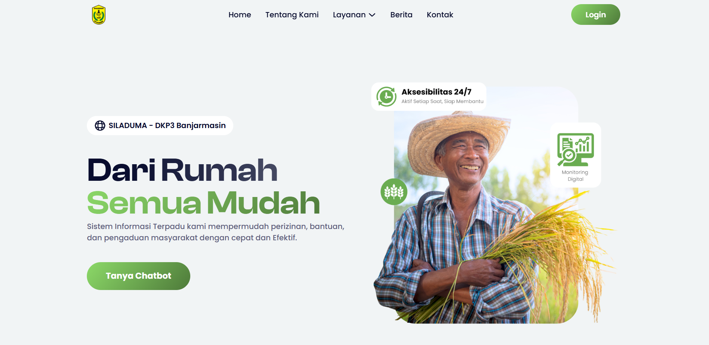

# Sistem Informasi Pelayanan Terpadu untuk Perizinan Permohonan Bantuan dan Pengaduan Masyarakat (SILADUMA)

## Deskripsi
SILADUMA adalah sistem informasi berbasis web yang dirancang untuk mengelola umpan balik masyarakat, termasuk pengaduan dan survei kepuasan, serta menyederhanakan proses administratif seperti perizinan dan bantuan. Dengan antarmuka modern dan responsif, SILADUMA memastikan pelayanan publik yang cepat, efektif, dan mudah diakses dari rumah.

### Pratinjau Visual

